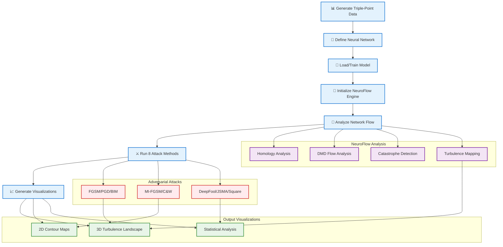

# NeuroFlow Demo - System Architecture Diagram

This is the main mermaid diagram for the `neuroflow_demo.ipynb` notebook system.

## Complete NeuroFlow System Architecture

## System Components

### 📊 Data Generation & Preparation
- **Triple-Point Data Generator**: Creates synthetic dataset with catastrophe scenarios
- **MNIST Dataset Loading**: Standard benchmark dataset for neural network testing
- **DataLoader Preparation**: Batch processing and data pipeline setup

### 🧠 Neural Network Architecture
- **SimpleNet Definition**: Basic neural network architecture with Conv2d and FC layers
- **CNN Model**: Convolutional neural network for image processing
- **Model Initialization**: Weight initialization and architecture setup

### 🌊 NeuroFlow Engine System
- **ActivationRecorder**: Captures intermediate layer activations during forward passes
- **ChainMapHomology**: Detects structural dead zones using SVD analysis
- **DMDFlowAnalyzer**: Dynamic Mode Decomposition for flow field estimation
- **SpectralAnalyzer**: Graph-based turbulence analysis
- **CatastropheDetector**: Identifies decision boundary singularities

### ⚔️ Extended Adversarial Arsenal
- **FGSM**: Fast Gradient Sign Method
- **PGD**: Projected Gradient Descent
- **BIM**: Basic Iterative Method
- **MI-FGSM**: Momentum Iterative FGSM
- **C&W**: Carlini & Wagner attack
- **DeepFool**: Minimal perturbation attack
- **JSMA**: Jacobian-based Saliency Map Attack
- **Square Attack**: Black-box random search

### 📈 Visualization & Analysis
- **PCA Transformation**: Dimensionality reduction for activation space analysis
- **3D Turbulence Landscapes**: Interactive visualization of catastrophe regions
- **2D Contour Maps**: Level-set visualization of turbulence regions
- **Statistical Analysis**: Quantitative comparison of attack methods

## Key Features

- **Complete Flow Analysis**: From data generation to final visualization
- **8 Attack Methods**: Comprehensive adversarial testing suite
- **Scientific Approach**: Based on mathematical analysis of neural flow dynamics
- **Interactive Visualization**: 3D landscapes and statistical comparisons
- **Catastrophe Detection**: Identifies decision boundary singularities

This diagram represents the complete workflow implemented in the `neuroflow_demo.ipynb` notebook.