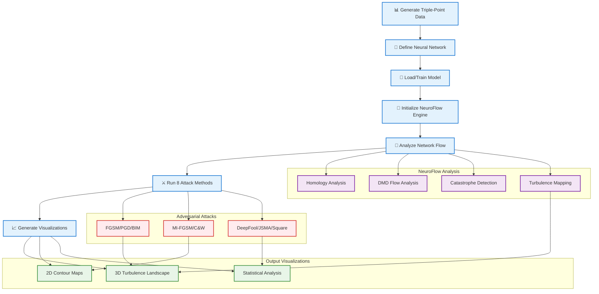
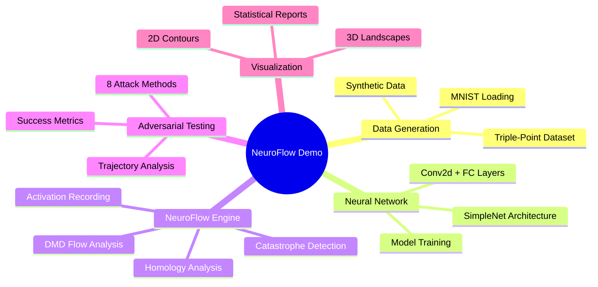
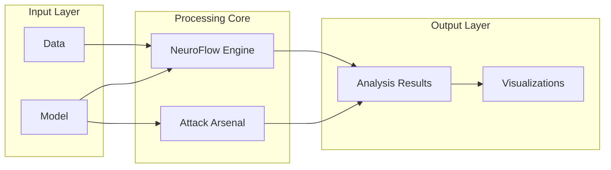

# NeuroFlow Demo - Compact Mermaid Diagram

A simplified version of the NeuroFlow demonstration workflow for easier viewing and understanding.

## Simplified Workflow

## Key Components Overview

## System Architecture Summary

This compact version highlights the main workflow and key components of the NeuroFlow demonstration system without overwhelming detail.