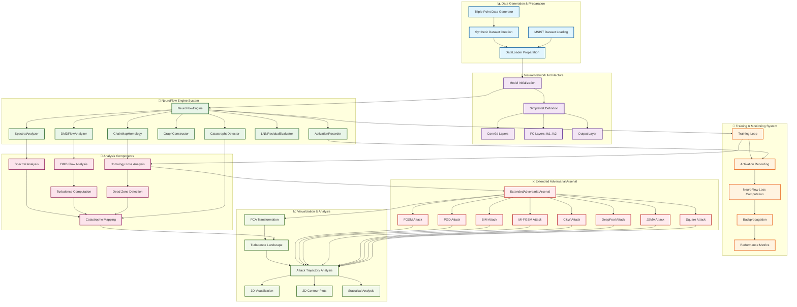
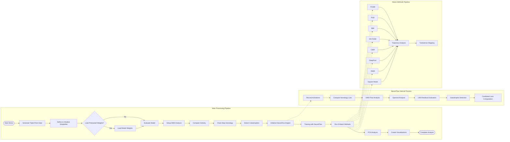
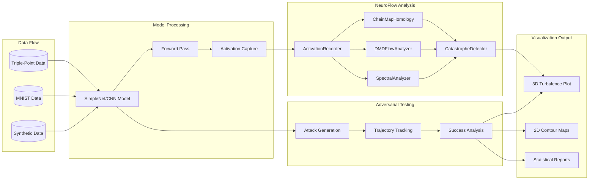

# NeuroFlow Demo - Mermaid Diagram

This mermaid diagram represents the complete workflow and system architecture of the `neuroflow_demo.ipynb` notebook, which demonstrates catastrophe detection via Neural Navier-Stokes analysis.

## Complete System Architecture

## Detailed Flow Analysis

## Component Interaction Diagram

## Key Features and Capabilities

### 🔬 Scientific Analysis Components
- **Chain Map Homology**: Detects structural dead zones using SVD analysis
- **Dynamic Mode Decomposition (DMD)**: Estimates flow field evolution
- **Spectral Analysis**: Graph-based turbulence detection
- **Catastrophe Detection**: Identifies decision boundary singularities

### ⚔️ Adversarial Attack Arsenal
- **8 Different Attack Methods**: FGSM, PGD, BIM, MI-FGSM, C&W, DeepFool, JSMA, Square Attack
- **Trajectory Analysis**: Tracks attack paths in activation space
- **Universal Landscape**: Demonstrates all attacks climb the same catastrophe mountains

### 📊 Visualization Capabilities
- **3D Turbulence Landscapes**: Interactive visualization of catastrophe regions
- **PCA-based Analysis**: Dimensionality reduction for interpretability
- **Statistical Comparisons**: Quantitative analysis of attack effectiveness
- **Contour Maps**: Level-set visualization of turbulence regions

This diagram represents the complete architecture and workflow of the NeuroFlow demonstration system for catastrophe detection in neural networks.